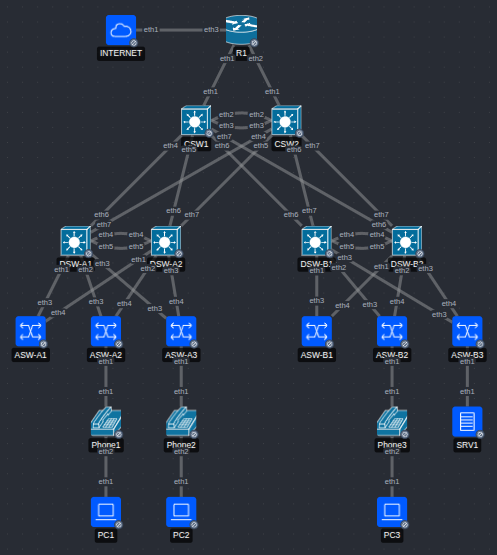

# JITL Mega (c)Lab + Ansible

A couple of weeks before I took the CCNA last May, I did [Jeremy's IT Lab's](https://www.jeremysitlab.com/) Mega Lab in Packet Tracer. It was great practice, and a great lab, except for Packet Tracer getting more and more unusable for crashing the closer I got to the end. So I'm thinking, why not try to reproduce most of it in containerlab?

This project is a containerlab-based recreation of Jeremy's IT Lab's CCNA Mega Lab. The goal was to reproduce the lab's networking functionality as closely as practical using containerlab, Arista cEOS, Cisco vIOS where necessary, and lightweight Linux containers for services that Packet Tracer provides natively.

This project also served as a crash course for myself in Ansible. The network is deployed and configured through working Ansible playbooks covering VLANs, Layer 2 and Layer 3 EtherChannel, FHRPs, STP, OSPF, DHCP, DNS, NTP, ACLs, Layer 2 security, and related services. Because the original lab targets Cisco IOS and Packet Tracer, some features were substituted or omitted where containerlab, cEOS, or the available Linux containers could not reproduce them directly. The implementation notes below document those differences rather than attempting to hide them.

A disclaimer: the playbooks are organized around the sequential steps of the original Packet Tracer lab, so some configuration is more procedural than a better, fully declarative design would be. In several places, however, the project does use generated variables, resource modules, templates, and shared state to derive configuration rather than hard-coding the final device state. Improving the project toward a more declarative desired-state model would be a natural next step.

## Implementation Notes and Deviations from Instructions

### containerlab setup

- I'm using an Arista cEOS image for routers and switches, since it's freely available, relatively lightweight, and substantially similar to IOS. I'm using about 80% of my 32GB available RAM as it is.
  - I learned the hard way the cEOS doesn't support NAT. So R1 is not running Cisco vIOS.
- I have omitted the WLCs and LWAPs for now. Will most likely add these later.
- I represented the phones with Alpine nodes. A virtual bridge will connect to the switches with a trunk link (with untagged traffic in the access VLAN and tagged traffic in the voice VLAN). It's currently configured explicitly but might try to make it LLDP-aware in the future.
- The Internet is also represented by an Alpine node, with dummy interfaces that have the IPs use in the DNS config from step 6.
- AFAIK, clab/EOS doesn't allow me to use the original port numbers, so physical connections have been mapped to flat-indexed Ethernet ports.

### Part 1 - Initial setup

- I skipped this phase entirely. Containerlab handled hostnames, and for my present purposes I'm not concerned about the enable secret or user account Ansible uses.

### Part 2 - VLANs, Layer-2 EtherChannel

- Since PAgP isn't available, I used LACP for both distribution layer port-channels. DTP and VTP aren't in play, either; DTP-related instructions are ignored, and VLANs are pushed to all distribution- and access-layer switches with Ansible instead.
- AFAIK, "voice" VLANs ("phone" VLANs in EOS) are not available in Ansible resource modules, so the voice VLANs on the appropriate ports of E1 on ASW-A2, -A3, and -B2 are declared separately in their respective host_vars files, and attached in a separate, imperative CLI-coded task. (In general I've tried to write my playbooks declaratively with resource modules)

### Part 3 - IP Addresses, Layer-3 EtherChannel, HSRP

- Used LACP again instead of PAgP, and used VRRP instead of HSRP for my FHRP.
- Set VRRP IPs algorithmically.
- SRV1's net configuration will go in containerlab instead of Ansible

### Part 4 - Rapid Spanning Tree Protocol

- Since PVST+ is Cisco proprietary, I used MSTP instead.
- Although this is the shortest and simplest step in the lab (only asking us to configure STP and enable PortFast/BPDUGuard), I thought it would be an interesting exercise to have the STP configuration play ingest the FHRP configuration from the last step and mirror the STP configuration accordingly. Since STP and FHRPs normally ought to be configured alike, I suppose it makes sense to do this with a SSOT.

### Part 5 - Static and Dynamic Routing

- I didn't bother adding R1's OSPF interface from `config-if`; I just pushed the same template issuing `network` commands to all the OSPF-aware devices.
- Since the DSW SVI IPs aren't statically written down anywhere, I cheated a bit and used the FHRP VIP + corresponding wildcard mask to add those interfaces to OSPF where needed. For lab purposes, this should be fine - each device only has one real interface/IP in the corresponding subnet, so there shouldn't be any unexpected overlap. And this seemed better than regenerating those IPs on the fly; even though those IPs are generated deterministically and it should work, it's just extra unnecessary computation that would carry some risk of getting "out of sync" with the IPs generated in the Part 3 playbook (however unlikely for lab purposes). (I suppose IRL it would be better to use NetBox or a more rigid schema for your SSOT to keep everything in sync and provide different forms of the same data to different plays.)
- There is only one connection to the Internet in my setup, so I skipped the floating static route step. It also receives its default route over DHCP rather than being configured statically and originates it over OSPF.

### Step 6 - DHCP, DNS, NTP, SNMP, Syslog, FTP, SSH, NAT

- I skipped the FTP and SSH steps.
- SRV1 is running dnsmasq and rsyslog. INTERNET is running dnsmasq (for DHCP) and chrony (NTP).
- My NAT pool on R1 is configured to use 6 addresses instead of the 8 in the instructions - IOS would happily use all 8 addresses in a /29 netmask for a NAT pool, but the first and last addresses would cause problems on the INTERNET/Alpine routing table side.

### Step 7 - Security: ACLs and Layer-2 Security Features

**tl;dr:** this step was a huge letdown.

- Referring to resource module docs for EOS ACLs, I wrote my plays to create ACLs and apply them to interfaces. Verbose output revealed nothing was actually changing. Turns out cEOS doesn't actually implement access groups. Oh well.
- Port Security should be working. I looped through my l2_interface definitions and allowed 2 addresses if there's a voice VLAN assigned, one if not. Works for this.
  - Apparently, EOS doesn't have a `restrict` violation mode, so I used `protect` instead.
- **DHCP Snooping/DAI:** this was a rabbit hole and a half. I learned that Arista handles this layer of security entirely differently than Cisco. Basically, if I understand correctly, the `ip dhcp snooping` family of commands in EOS mostly deals with "bridging" and Option 82 insertion. It doesn't deal with blocking rogue DHCPACKs--rather, this is the job of `address locking`. With `address locking`, you make sure that the ASW has a layer-3 interface routable to the DHCP server, it builds its binding table with RFC 4388 LeaseQuery rather than the whole passive DHCP monitoring thing, and then you apply locking to untrusted ports rather than the other way around. Apparently, it's possible to have it build the table passively, but to do that, you have to specify a single DHCP-server-facing interface, and that probably won't work here since all the ASWs are connected to two DSWs that each could be forwarding legit DHCP traffic. So I was good and ready to try configuring this by hand on an ASW to see if vIOS on R1 would even play nice with it, then, come to find out, `address locking` isn't supported in containerized EOS. Oh well.
